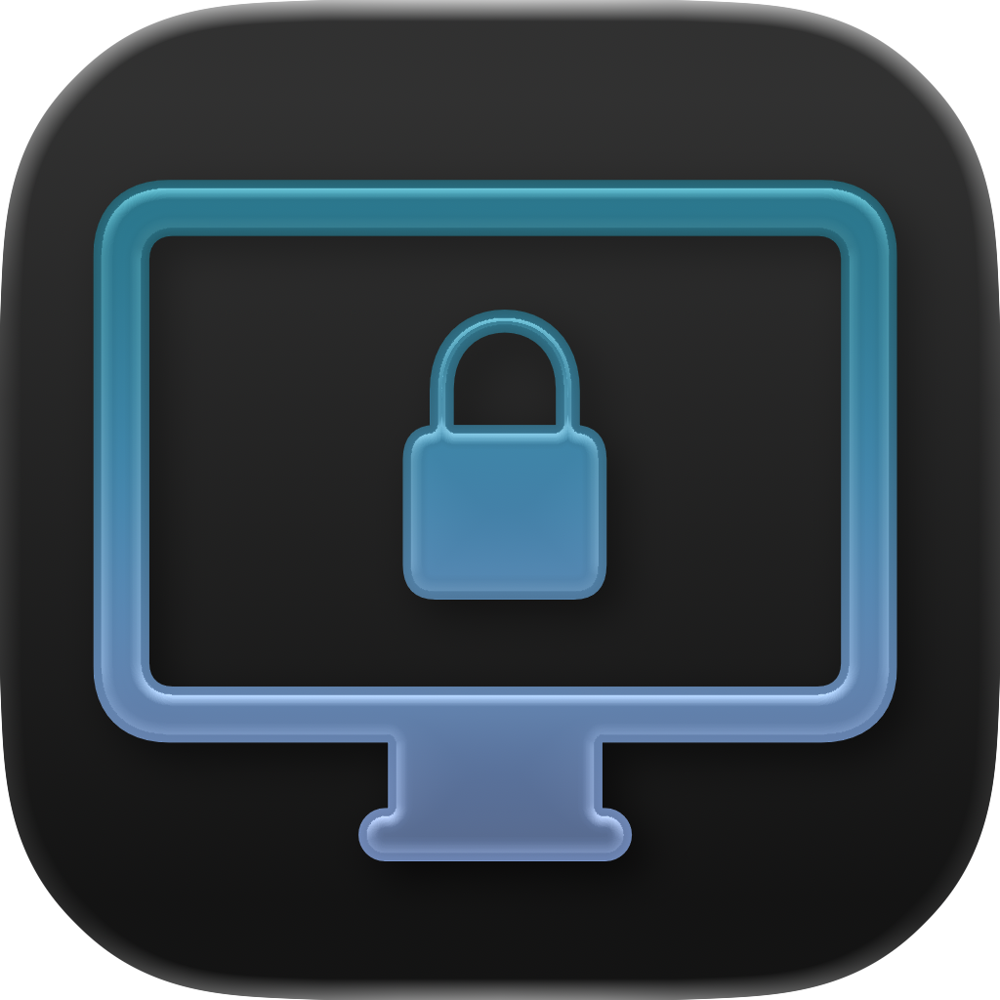
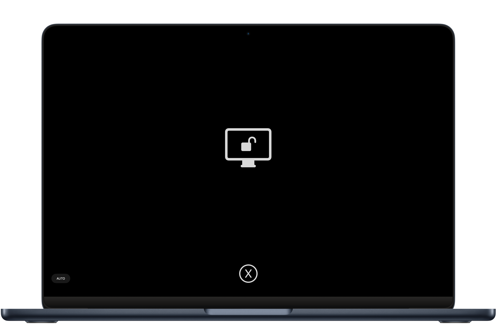

  

  <h1 align="center">ScreenClean</h1>

## Features

- ScreenClean hides all your content from your screen so you can clean your Mac display without distractions.
- Lock your complete keyboard with a single button press so you can clean it without pressing random keys, skipping to the next song or activating Siri.
- Enable **autostart mode** to lock the keyboard immediately after opening the app.

## Download

> [!WARNING]
> Since I don't have an Apple Developer Account, the app will show a popup on the first launch saying that the app couldn't be verified. To launch the app:
> 
> 1.  Click **OK** to close the popup
> 2.  Open **Settings** -> **Privacy & Security**
> 3.  Scroll down until you see **ScreenClean**
> 4.  Click **Run anyway**
> 
> You only have to do this on the first launch of the App

### Direct Download

See [Releases](https://github.com/Noah-Johann/ScreenClean/releases) for the latest version.

### System Requirements
- **macOS 13 Ventura or later**

## License
ScreenClean is licensed under the GNU General Public License v3.0. See [`License.md`](/LICENSE) for more details.

